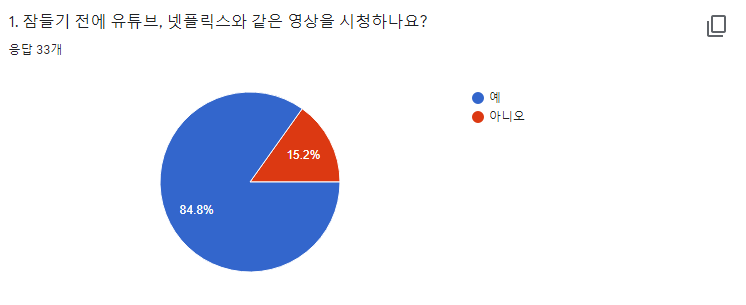
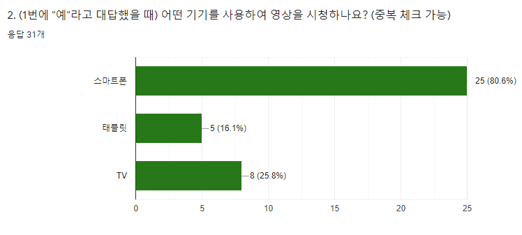
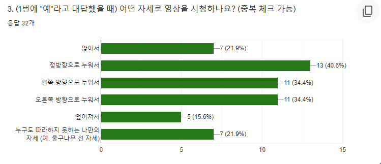
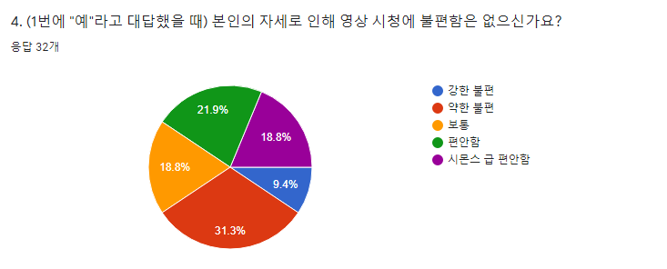
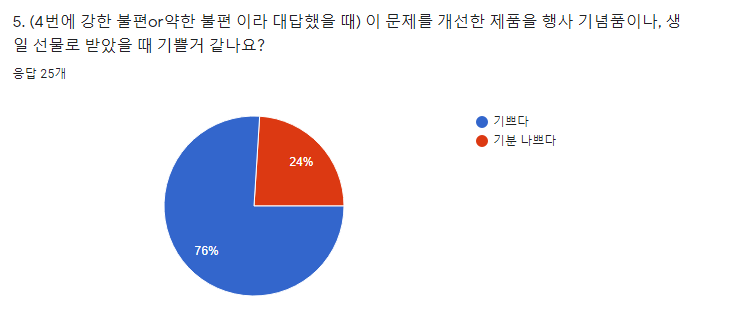
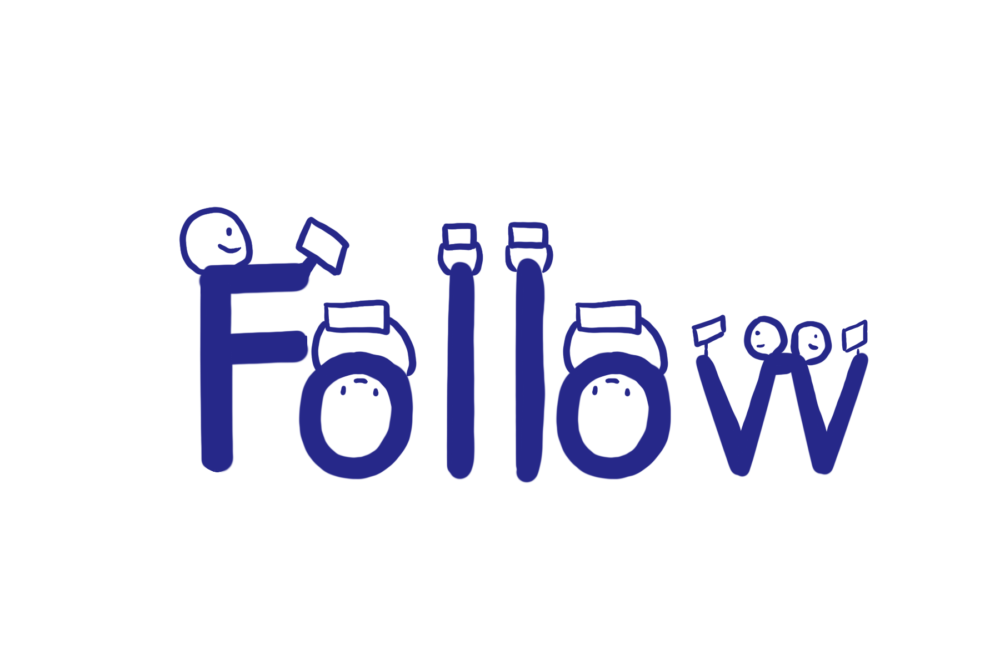

---
#
# Here you can change the text shown in the Home page before the Latest Posts section.
#
# Edit cayman-blog's home layout in _layouts instead if you wanna make some changes
# See: https://jekyllrb.com/docs/themes/#overriding-theme-defaults
#
layout: home
---

## 도오트의 고민  

도오트*(#20대직장인 #나의힐링은_유튜브 #손목터널증후군)*씨는  
퇴근 후 유튜브를 보며 잠에 드는 것이 유일한 행복이다.  

하지만 무거운 스마트폰을 들고 침대 위에서 영상을 보는 것은 손목이 매우 아프다.  
자바라라는 제품을 사용하려 하지만, 도씨는 침대 위에서 이리 저리 움직이는 편이라 정방향으로 스마트폰 화면을 보지 못한다.  

그런데!!!  

도씨는 회사에서 나눠 준 제품을 사용한 뒤 이러한 문제를 말끔히 해결했다.    
무슨 일이 벌어진 것일까?  

## 도오트가 이용한 것은!?  

안녕하세요, **'누워서 편하게 영상보기'**라는 컨셉으로 팔로우(Follow)라는 프로젝트를 진행한 8조입니다.  

저희는 아두이노를 이용한 로봇팔을 사용하여 팔로우를 개발했습니다.  

그럼 저희 프로젝트에 대해 자세히 소개해보도록 하겠습니다.
  

## 오트론 공채 13기의 잠들기 전 행동 분석  

저희는 오트론 공채 13기 (40명)을 대상으로 설문조사를 진행했고, 33명의 응답을 받았습니다.  

  

  

13기 신입사원도 잠들기 전 다양한 기기를 통해 영상 시청을 한다는 것을 설문조사를 통해 알게 되었습니다.  

  

  

그리고 이때, 여러 자세로 시청을 하기 때문에 **50.1%**의 인원이 불편함을 느낀다는 것을 알게되었습니다.  

  

마지막으로 본 설문조사를 통해 76%의 인원이 기꺼이 이러한 제품을 원한다는 것을 알 수 있었습니다.  

## 그래서 팔로우가 뭐예요?  

  

**팔로우**는 일반적인 자바라와 달리, 사용자의 움직임을 따라 스마트폰 스크린의 방향을 바로잡아주는 기기입니다.  

프로토타입의 팔로우는 *제스쳐센서*를 사용하여 개발되었지만, 카메라를 통한 동체추적을 사용한다면 정확한 제어가 가능할 것입니다.  

## 팔로우를 통해 무엇을 알 수 있을까요?  

